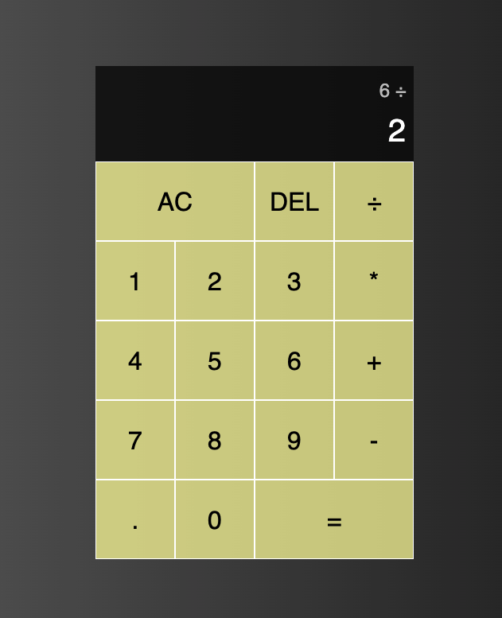

# calculator
This is a calculator project made for the Odin Project course. 
The project is written in vanilla javascript. 

## Page view

## Live link
<a href="https://cheeterlee.github.io/calculator/">The calculator</a>

